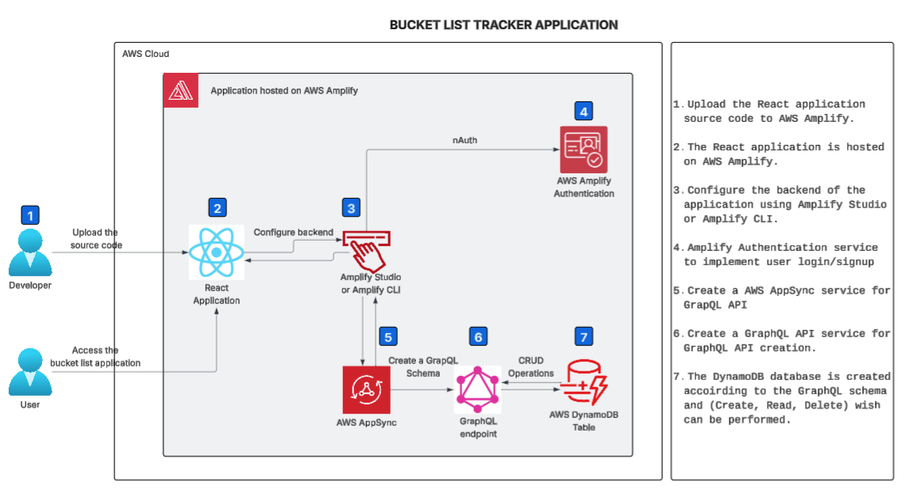
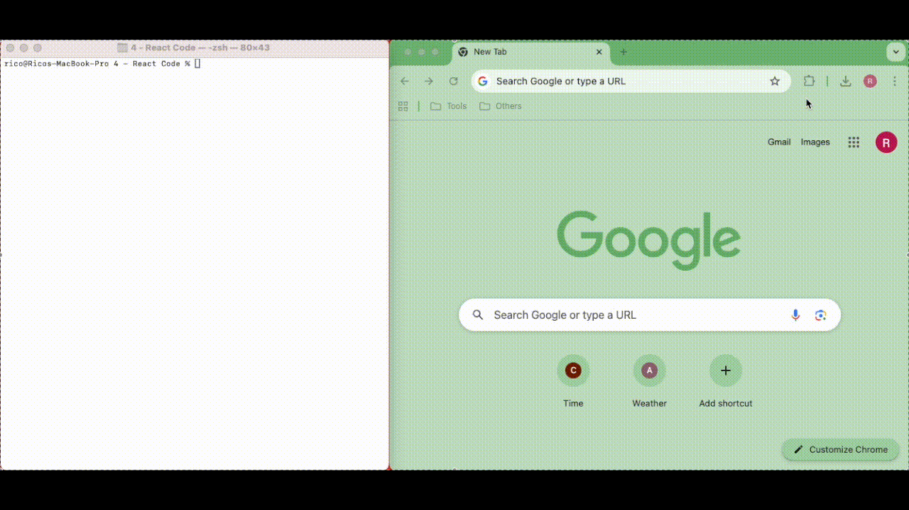
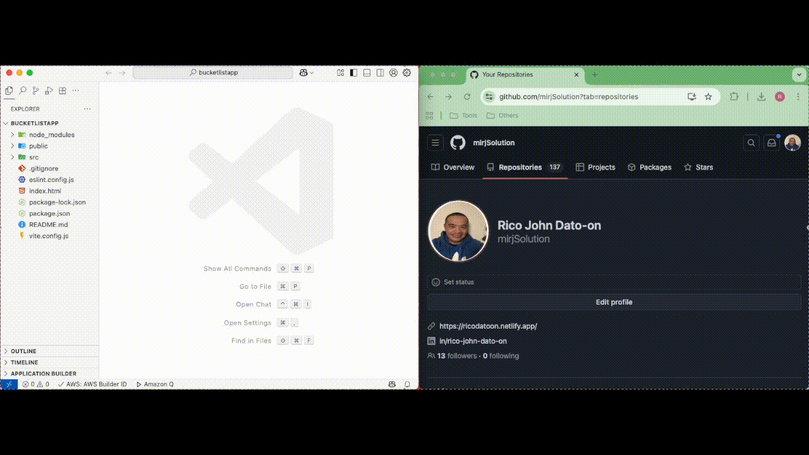
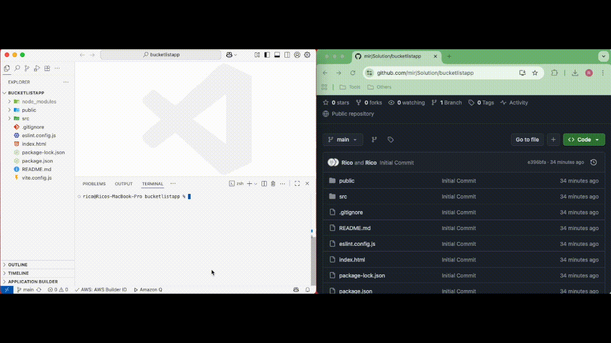
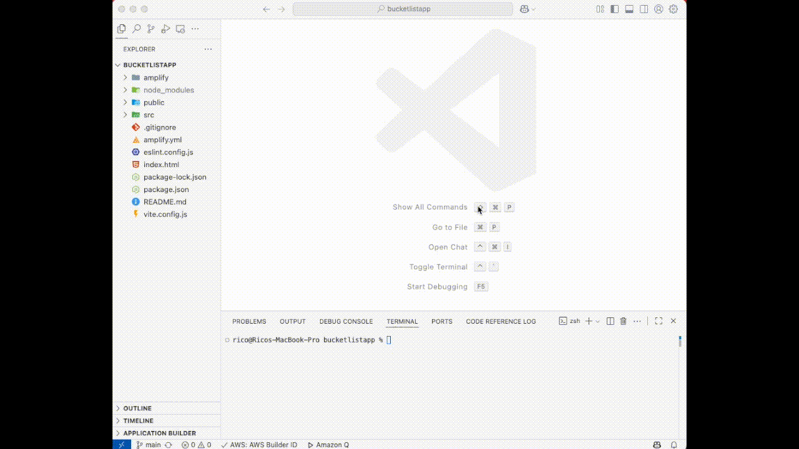

# 📋 Bucket List Tracker - AWS Amplify Documentation

## 📖 Table of Contents

1. [Project Overview](#-project-overview)
2. [Create and Deploy React Frontend App](#-create-and-deploy-react-frontend-app)
   - [Create a React Application](#create-a-react-application)
   - [Initialize a GitHub Repository](#initialize-a-github-repository)
   - [Install the Amplify Packages](#install-the-amplify-packages)
   - [Deploy Your App to AWS Amplify](#deploy-your-app-to-aws-amplify)
3. [Setup Amplify Backend](#-setup-amplify-backend)
   - [Setup Amplify Authentication](#setup-amplify-authentication)
   - [Setup Amplify Data](#setup-amplify-data)
   - [Setup Amplify Storage](#setup-amplify-storage)
   - [Finalize Backend Setup](#finalize-backend-setup)
   - [Deploy the Amplify Backend in a Cloud Sandbox](#deploy-the-amplify-backend-in-a-cloud-sandbox)
4. [Connecting Frontend and Backend](#-connecting-frontend-and-backend)
   - [Install Amplify Libraries](#install-amplify-libraries)
   - [UI Setup and Styling](#ui-setup-and-styling)
   - [Launch the App Locally](#launch-the-app-locally)
   - [Push the Changes on GitHub](#push-the-changes-on-github)
5. [Conclusion & Clean-up](#-conclusion--clean-up)

---

## ☁️ Project Overview

### Overview of Project

The final project is to deploy a 'Bucket List Tracker' application on AWS Amplify. It will take longer than the others to build out, but by the end of it, you will learn a lot about how to create serverless applications.

### 👩‍💻 Steps to be performed

In the next few lessons, we'll be going through the following steps:

1. Develop a bucket list tracker application in React
2. Initialize a Github repository and connect it to your local repository. Host the frontend on Amplify Hosting
3. Use Amplify Studio/ Amplify CLI and integrate Amplify Authentication providing user authentication for Login/Signup
4. Create a AWS AppSync service for building and managing a GraphQL API, and a GraphQL schema for DynamoDB service integration
5. Deploy the backend on AWS Amplify to handle data storage and server-side logic

### 🛠 Services Used

- **AWS Amplify**: Deployment of frontend and backend services
- **AWS AppSync**: Simplifies building and managing scalable GraphQL APIs
- **GraphQL API**: Allows clients to request only the data they need [API & Schema]
- **DynamoDB**: DynamoDB for storing and managing bucket list items [Database]
- **S3 bucket**: For storage of user images [Storage]

### ⚙️ Estimated Time & Cost

- **Time**: This project is estimated to take about 1 - 1.5 hours
- **Cost**: Free (When using the AWS Free Tier)

### Diagram



---

## 🚀 Create and Deploy React Frontend App

### Introduction

AWS Amplify provides a Git-based CI/CD workflow that allows you to build, deploy, and host single-page web applications or static sites with serverless backends.

It automatically detects the build settings for both the frontend and any serverless backend resources when connected to a Git repository. With each code commit, Amplify redeploys updates automatically.

In this section, you'll create a new React application for your bucket list tracker, push it to a GitHub repository, and connect it to AWS Amplify for deployment.

### Create a React Application

#### Create a React App

1. Open a new terminal window and run the following commands to create a React app using Vite:

```bash
npm create vite@latest bucketlistapp -- --template react
cd bucketlistapp
npm install
npm run dev
```



2. In the terminal window, click the Local link to open the Vite + React application in your browser and view your bucket list tracker.

✅ You have successfully created a React application.

### Initialize a GitHub Repository

#### Initialize a Github Repository

In this step, you'll create a GitHub repository and commit your code.

1. Sign in to GitHub at https://github.com/. If you don't have an account, sign up first.

2. In the "Start a new repository" section, configure the following:
   - **Repository name**: `bucketlistapp`
   - Choose **Public**, then click **Create a new repository**

✅ You have successfully created a GitHub repository. Now, let us configure this repository with the local code.

3. In your VS Code terminal, navigate to the root folder of your app (`bucketlistapp`) and run the following commands to initialize a Git repository and push the code:

```bash
git init
git add .
git commit -m "initial commit"
git remote add origin git@github.com:<your-username>/bucketlistapp.git
git branch -M main
git push -u origin main
```

> **Note**: For the "git remote add origin git@github.com:<your-username>/bucketlistapp.git" command, you can get the URL from your GitHub repository page (or you can even copy the GitHub repository website URL).



### Install the Amplify Packages

#### Install the Amplify Packages

In this step, you'll scaffold an Amplify project for your app.

1. Run the following command in the terminal from your app's root folder:

```bash
npm create amplify@latest -y
```

This will scaffold a lightweight Amplify project in your app directory.

2. Push the changes to GitHub using the following commands:

```bash
git add .
git commit -m "installing amplify"
git push origin main
```



✅ With this, you have successfully installed the Amplify packages.

### Deploy Your App to AWS Amplify

#### Deploy Your App to AWS Amplify

Now, you will connect your GitHub repository to AWS Amplify, which will enable you to build, deploy, and host your bucket list tracker app.

1. Sign in to the AWS Management Console, and go to the AWS Amplify console at https://console.aws.amazon.com/amplify.

2. Click **Create new app**.

3. On the "Start building with Amplify" page, select **GitHub** for "Deploy your app" and click **Next**.

4. Authenticate with GitHub when prompted, and select the repository and branch (main) you created earlier. Click **Next**.

5. In the service role section. Click on **Create and use a new service role**. Keep the rest as default and click **Next**.

6. Review your selections and click **Save and deploy**.

Wait for AWS Amplify to create and deploy the app for you.


✅ And here we go!

You can check the website by clicking on the URL given in the Domain section.

AWS Amplify will now build your source code and deploy your app to a URL like https://...amplifyapp.com. Every time you push code to GitHub, Amplify will trigger a new deployment.

---

## 🔧 Setup Amplify Backend

### Introduction

In this task, you will use AWS Amplify to provision a cloud backend for your bucket list tracker application. This includes setting up authentication, data storage, and file storage, which will allow users to manage their bucket lists.

Now that you have a React-based bucket list tracker app, the next step is to configure a cloud backend using AWS Amplify.

With Amplify, you can set up authentication, data storage, and file storage with a unified developer experience.

Amplify allows you to build and deploy fullstack applications using a code-first approach, with built-in hosting, backend, and UI-building capabilities.

### Setup Amplify Authentication

#### Setup Amplify Authentication

The app will allow users to sign up using their email, and upon sign-up, they will receive a verification email.

By default, your authentication resource is configured in the `bucketlistapp/amplify/auth/resource.ts` file. For this project, keep the default authentication settings as they are.

### Setup Amplify Data

#### Setup Amplify Data

In this step, you will define a schema for storing the bucket list items. Each user will be able to create, delete, and list their own bucket list entries, and Amplify will automatically handle per-user ownership of the data.

1. On your vscode, navigate to the `bucketlistapp/amplify/data/resource.ts` file and update it with the following code given below.

2. This code will define a model for the bucket list items, ensuring that only the owner can access their data.


In this schema:

- Each bucket list item includes a title, description, and a completed status
- The authorization rule ensures that only the user who created the item can access it

### Setup Amplify Storage

#### Setup Amplify Storage

You will set up file storage to allow users to upload images related to their bucket list items (optional feature).

1. Create a new folder called `storage` inside the `bucketlistapp/amplify` folder, and inside that, create a new file named `resource.ts`.

2. Update the `resource.ts` file with the following code to configure storage for images:



This storage configuration ensures that only the person who uploads the image can access it. The `entity_id` will be replaced with the user's identifier during file uploads, restricting access to the file.

### Finalize Backend Setup

#### Finalize Backend Setup

Now, you need to link the authentication, data, and storage resources in your Amplify backend configuration.

On your local machine, navigate to the `amplify/backend.ts` file and update it with the following code given below:

```typescript
import { defineBackend } from "@aws-amplify/backend";
import { auth } from "./auth/resource";
import { data } from "./data/resource";
import { storage } from "./storage/resource";

defineBackend({
  auth,
  data,
  storage,
});
```

This ensures that all the backend resources (auth, data, and storage) are properly configured and linked.

### Deploy the Amplify Backend in a Cloud Sandbox

#### Deploy the Amplify Backend in a Cloud Sandbox

Now, you'll deploy your Amplify backend resources to a personal cloud sandbox environment, which allows you to rapidly build, test, and iterate on your app.

1. In a new terminal window, run the following command from your app's root folder:

```bash
npx ampx sandbox
```

> **Troubleshooting**: After running the above command, if you get the following error: `SSMCredentialsError: UnrecognizedClientException: The security token included in the request is invalid.`
>
> Run this command: `aws configure`
>
> You can get the access key and secret access key by navigating to AWS Console > IAM > Users
>
> If User is available, navigate to the security credentials to get the keys. If no user is available, create one by clicking on Create User.

This command starts a Cloud sandbox, which is an isolated development environment connected to AWS Cloud resources. Each developer can use their own disposable sandbox for rapid iteration.

2. Once the sandbox has been fully deployed, you will see a confirmation message, and an `amplify_outputs.json` file will be generated and added to your project.

✅ With these steps, your bucket list tracker application now has a fully configured backend, including user authentication, data storage, and file storage.

You're ready to move forward with implementing the application's frontend logic to interact with the backend services.

---

## 🔗 Connecting Frontend and Backend

### Introduction

In this task, you will build the frontend of your bucket list tracker app and connect it to the cloud backend you have already set up.

You will use AWS Amplify's UI component library to create a complete user authentication flow and implement the ability to create, update, and delete bucket list items.

Additionally, you will create the frontend of the bucket list tracker, where users can add, update, and delete items on their bucket list. They will also be able to upload images associated with each item.

### Install Amplify Libraries

#### Install Amplify Libraries

Open a new terminal window, navigate to the project folder (`bucketlistapp`), and run the following command to install the necessary Amplify libraries:

```bash
npm install aws-amplify @aws-amplify/ui-react
```

These libraries include the client-side APIs to connect your app's frontend to the backend services and the UI components for authentication.

### UI Setup and Styling

#### UI Setup and Styling

1. On your local machine, navigate to the `bucketlistapp/src/index.css` file.

2. Update it with the following code to style the bucket list UI:

```css
:root {
  font-family: Inter, system-ui, Avenir, Helvetica, Arial, sans-serif;
  line-height: 1.5;
  font-weight: 400;
  color: rgba(255, 255, 255, 0.87);
  font-synthesis: none;
  text-rendering: optimizeLegibility;
  -webkit-font-smoothing: antialiased;
  -moz-osx-font-smoothing: grayscale;
  max-width: 1280px;
  margin: 0 auto;
  padding: 2rem;
}

.card {
  padding: 2em;
}

.read-the-docs {
  color: #888;
}

.box:nth-child(3n + 1) {
  grid-column: 1;
}
.box:nth-child(3n + 2) {
  grid-column: 2;
}
.box:nth-child(3n + 3) {
  grid-column: 3;
}
```

This will set the layout and styles for the bucket list UI, making it responsive and visually appealing.

3. On your local machine, navigate to the `bucketlistapp/src/App.jsx` file.

4. Update it with the following code to App.jsx:

```jsx
import { useState, useEffect } from "react";
import {
  Authenticator,
  Button,
  Text,
  TextField,
  Heading,
  Flex,
  View,
  Image,
  Grid,
  Divider,
} from "@aws-amplify/ui-react";
import { Amplify } from "aws-amplify";
import "@aws-amplify/ui-react/styles.css";
import { getUrl } from "aws-amplify/storage";
import { uploadData } from "aws-amplify/storage";
import { generateClient } from "aws-amplify/data";
import outputs from "../amplify_outputs.json";

/**
 * @type {import('aws-amplify/data').Client<import('../amplify/data/resource').Schema>}
 */

Amplify.configure(outputs);
const client = generateClient({
  authMode: "userPool",
});

export default function App() {
  const [items, setItems] = useState([]);

  useEffect(() => {
    fetchItems();
  }, []);

  async function fetchItems() {
    const { data: items } = await client.models.BucketItem.list();
    await Promise.all(
      items.map(async (item) => {
        if (item.image) {
          const linkToStorageFile = await getUrl({
            path: ({ identityId }) => `media/${identityId}/${item.image}`,
          });
          console.log(linkToStorageFile.url);
          item.image = linkToStorageFile.url;
        }
        return item;
      })
    );
    console.log(items);
    setItems(items);
  }

  async function createItem(event) {
    event.preventDefault();
    const form = new FormData(event.target);
    console.log(form.get("image").name);

    const { data: newItem } = await client.models.BucketItem.create({
      title: form.get("title"),
      description: form.get("description"),
      image: form.get("image").name,
    });

    console.log(newItem);
    if (newItem.image)
      await uploadData({
        path: ({ identityId }) => `media/${identityId}/${newItem.image}`,
        data: form.get("image"),
      }).result;

    fetchItems();
    event.target.reset();
  }

  async function deleteItem({ id }) {
    const toBeDeletedItem = {
      id: id,
    };

    const { data: deletedItem } = await client.models.BucketItem.delete(
      toBeDeletedItem
    );
    console.log(deletedItem);

    fetchItems();
  }

  return (
    <Authenticator>
      {({ signOut }) => (
        <Flex
          className="App"
          justifyContent="center"
          alignItems="center"
          direction="column"
          width="70%"
          margin="0 auto"
        >
          <Heading level={1}>My Bucket List</Heading>
          <View as="form" margin="3rem 0" onSubmit={createItem}>
            <Flex
              direction="column"
              justifyContent="center"
              gap="2rem"
              padding="2rem"
            >
              <TextField
                name="title"
                placeholder="Bucket List Item"
                label="Bucket List Item"
                labelHidden
                variation="quiet"
                required
              />
              <TextField
                name="description"
                placeholder="Description"
                label="Description"
                labelHidden
                variation="quiet"
                required
              />
              <View
                name="image"
                as="input"
                type="file"
                alignSelf={"end"}
                accept="image/png, image/jpeg"
              />

              <Button type="submit" variation="primary">
                Add to Bucket List
              </Button>
            </Flex>
          </View>
          <Divider />
          <Heading level={2}>My Bucket List Items</Heading>
          <Grid
            margin="3rem 0"
            autoFlow="column"
            justifyContent="center"
            gap="2rem"
            alignContent="center"
          >
            {items.map((item) => (
              <Flex
                key={item.id || item.title}
                direction="column"
                justifyContent="center"
                alignItems="center"
                gap="2rem"
                border="1px solid #ccc"
                padding="2rem"
                borderRadius="5%"
                className="box"
              >
                <View>
                  <Heading level="3">{item.title}</Heading>
                </View>
                <Text fontStyle="italic">{item.description}</Text>
                {item.image && (
                  <Image
                    src={item.image}
                    alt={`Visual for ${item.title}`}
                    style={{ width: 400 }}
                  />
                )}
                <Button
                  variation="destructive"
                  onClick={() => deleteItem(item)}
                >
                  Delete Item
                </Button>
              </Flex>
            ))}
          </Grid>
          <Button onClick={signOut}>Sign Out</Button>
        </Flex>
      )}
    </Authenticator>
  );
}
```

### Launch the App Locally

#### Launch the App Locally

1. Open a terminal window, navigate to the root folder (`bucketlistapp`), and run the following command to launch the app:

```bash
npm run dev
```

2. Open the local host link that appears in your terminal to view the application.

3. Choose the **Create Account** tab and use the authentication flow to sign up by entering your email and password. Then, create your account.

4. You will receive a verification code via email. Enter the verification code to log in.

5. Once signed in, you can start adding items to your bucket list and managing them.

### Push the Changes on GitHub

#### Push the Changes on GitHub

1. After making changes to the app, push them to GitHub with the following commands:

```bash
git add .
git commit -m 'bucket list tracker app'
git push origin main
```

2. Sign in to the AWS Management Console, and open the AWS Amplify console.

3. AWS Amplify will automatically build your source code and deploy your app at a URL like https://...amplifyapp.com. On every git push, Amplify will update your deployment.

4. Select the **Visit deployed URL** button to see your bucket list tracker live.

---

## 🎉 Conclusion & Clean-up

### Conclusion

🎊 **Congratulations on completing this project!!** You have successfully created a Bucket List Tracker and deployed it on Amplify.

#### What's Next?

- You can try upgrading the UI of the application according to your liking
- Register a domain name for your website

### 🧹 Clean-up

1. In the Amplify console, in the left-hand navigation for the **bucketlistapp**, choose **App settings**, and select **General settings**.

2. In the **General settings** section, choose **Delete app.**

---

## 📚 Key Features Implemented

✅ **User Authentication**: Email-based signup and login with verification  
✅ **CRUD Operations**: Create, read, and delete bucket list items  
✅ **Image Upload**: Store and display images for bucket list items  
✅ **Responsive Design**: Mobile-friendly UI with grid layout  
✅ **Real-time Updates**: Automatic synchronization with backend  
✅ **Secure Access**: Per-user data isolation and authorization

## 🛠️ Technologies Used

- **Frontend**: React with Vite, AWS Amplify UI Components
- **Backend**: AWS Amplify, AppSync, GraphQL
- **Database**: Amazon DynamoDB
- **Storage**: Amazon S3
- **Authentication**: Amazon Cognito
- **Hosting**: AWS Amplify Hosting
- **Version Control**: GitHub with CI/CD integration

---

_This documentation provides a complete guide for building and deploying a serverless Bucket List Tracker application using AWS Amplify's full-stack capabilities._
